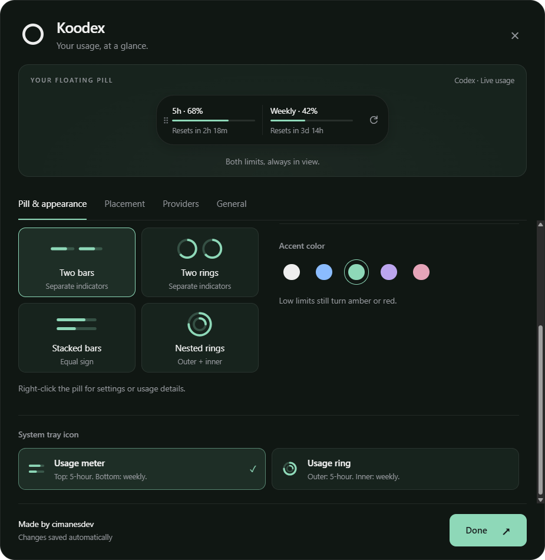
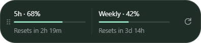

# Koodex

A quiet Windows tray companion for Codex and optional Claude Code quota reports.

**[Download Koodex for Windows](https://github.com/CimanesDev/Koodex/releases/latest)**

[Visit the Koodex website](https://cimanesdev.github.io/Koodex/)

Choose the `nsis.exe` installer (recommended) or the `portable.exe` standalone launcher under **Assets**. Requires Windows 11 x64 and a configured provider listed below. Release builds are unsigned and may display a Windows publisher warning.

## Features

- Codex usage events and configurable polling down to 10 seconds; remaining percentages and reset countdowns.
- Click the floating pill to switch quotas, or show both side by side.
- Optional countdowns and a one-click refresh button on the pill. Routine refresh activity stays hidden by default.
- Adjustable pill opacity (35�100%) with full visibility on hover or keyboard focus, plus a translucent glass-style surface.
- Ring or bar indicators, five accent colors, and a unified hover surface.
- A simple ring logo. Dual tray bars (top: 5-hour, bottom: weekly) or concentric rings (outer: 5-hour, inner: weekly).
- Indicator-only pills, combined or separate indicators, optional grips on every placement, and top/side pins that drag along their edge.
- Optional Claude Code status-line bridge with local change detection and explicit report freshness.
- Unified pill and appearance controls with visual style cards and a live usage preview.
- Branded setup wizard, first-run preferences, local caching, automatic reconnect, and optional startup and alerts. Made by cimanesdev.





## Resource use in 1.4

Settings and usage windows are created on demand and released one second after closing. Tray-only mode keeps no renderer windows; showing the pill uses one. Closing settings no longer leaves its renderer in memory. Manual-only pills avoid a periodic countdown timer when countdowns are off, and only opt-in automatic switching disables background throttling. Unchanged tray menus are reused, unchanged Codex cache writes are limited to once a minute, and Claude's file watcher runs only when Claude is selected or both providers are enabled. Live update intervals are unchanged.

In an isolated Windows sample-data run, private memory fell from **299.1 to 90.2 MiB** at tray-only startup and from **303.8 to 161.9 MiB** with the pill visible. The installer fell from **112.6 to 102.9 MB**; unpacked size fell from **395.0 to 336.2 MB**. Results vary by device and session. The memory measurements exclude the separate Codex CLI child. See [measurement details](docs/performance.md).

Packages include only the English Chromium locale, required runtime assets, and bundled application code. Screenshots, source maps, obsolete tray variants, and duplicate Node dependencies remain outside the package. Electron still dominates download size; reaching a few megabytes would require replacing the embedded browser runtime.

## Getting started

Run the installer for a branded welcome, installation-location choice, and completion screen, or use the portable executable. On first launch, choose your preferences under the Koodex header and click **Start Koodex**. The preview uses the selected provider's actual reports, including unavailable or stale states. Its refresh button refreshes real usage; clicking its one-limit display changes only the preview selection.

Click the tray icon for usage details. Right-click the floating pill for **Settings** or **Usage details**. Settings has its own window; **Done**, Close, and Escape dismiss it without opening usage details. Settings and the usage popup dismiss when another window or the desktop gets focus. The floating pill remains visible.

In settings:

- **Pill & appearance:** choose one or both limits, text or indicator-only, visual style cards (two bars, stacked bars, two rings, nested rings), accent, countdowns, quick refresh, switching behavior, opacity, Solid/Glass surfaces, and a usage meter/ring for the tray. Tray icon color follows the Windows taskbar theme; Light/Dark overrides are available.
- **Placement:** drag anywhere on the pill, with or without its optional grip. A click still switches limits; moving at least five pixels starts a drag. Free placement snaps near the left/right edges and top center. Pins move along their edge. Returning to free placement restores the previous free position. Changing the pin preset resets its edge offset. Enable **Collapsible side tab** with left/right placement to reveal or hide the pill with an animated edge tab; it starts collapsed.
- **Providers:** choose Codex or prepare the optional Claude Code bridge. Enable **Show both providers** to keep both visible with independent updates and connection states. The selected **Tray provider** controls the tray icon and low-usage alerts.
- **General:** configure startup, low-usage alerts, background refresh frequency, and an optional **Ctrl + Shift + K** or **Ctrl + Alt + K** shortcut to show or hide the pill. Shortcut conflicts are reported without replacing the working shortcut. Alerts fire once at 25%, 10%, and 0% remaining for each quota; a skipped threshold produces only the most urgent alert. Changing reset estimates does not repeat exhaustion alerts. Alerts rearm after the previous reset has passed and a fresh report confirms recovery.

One-limit mode is **click-only by default**. Automatic cycling starts only if you choose an interval. Upgrading from 1.0/1.1 turns off the old implicit auto-switch once; subsequent explicit choices are preserved. Existing users keep their other preferences and skip the welcome screen.

**Transparency:** lower **Pill opacity** under **Pill & appearance** to fade the whole pill. Hover or focus restores full opacity without changing the saved value. **Glass** adds a translucent tint and soft highlights; it is a glass-style finish, not Apple's native Liquid Glass or desktop blur. The live preview uses the same surface and opacity as the floating pill.

**Quiet refreshes:** **General ? Show refresh activity** is off by default, including for existing installs. Background refreshes still update usage; connection and error indicators remain visible.

Quick refresh requests a Codex snapshot or rereads the last Claude report. It cannot reset a quota. Tray bars and rings show both limits independently, rounded to 10% steps; the tooltip shows exact reported percentages. Top/outer always means 5-hour, bottom/inner means weekly, even when the other quota is absent. The static tray mark has been removed; previous mark selections migrate to the usage meter. With no data, the chosen usage icon shows empty tracks. Side-mounted combined bars are vertical: 5-hour on the left, weekly on the right.

For faster Codex updates, select **General > Refresh interval > Live · every 10 seconds**. New installs default to this; upgrades preserve the saved interval. Usage events trigger immediate reads, but server reporting may lag. This is near-real-time, not a guarantee of token-by-token updates.

## Claude Code and other providers

In **Providers**, select **Claude Code**. Koodex connects automatically, including on subsequent app launches. It merges the bridge into `~/.claude/settings.json` (or `CLAUDE_CONFIG_DIR`), keeps a dated backup before changes, and forwards the same input to an existing status-line command so its output is preserved. Invalid settings are left untouched with an error you can fix before reconnecting. Node.js must be on PATH. Run a supported, signed-in Claude Code session and complete a response to receive quota data. **Reconnect Claude Code** repairs the connection if you change your Claude configuration.

The bridge follows Claude's [documented status-line rate-limit fields](https://code.claude.com/docs/en/statusline), whose current example requires Claude Code 2.1.251+. It saves only five-hour/seven-day percentages, reset timestamps, and local receipt time. It does not save prompts, session IDs, transcripts, paths, or credentials. Koodex detects changed reports within about half a second, marks reports stale after approximately a minute or when a reported reset expires, and keeps the original timestamp when you refresh. An idle or unsupported Claude session cannot supply fresh account usage. Missing quota fields remain unavailable. The bridge represents the latest reporting session; it is not a multi-account aggregator. To disconnect, select Codex first, then restore `statusLine` from the dated settings backup (or remove it if you had no previous status line).

Claude support has been validated with documented sample payloads and real Electron/file integration, not a live Claude subscription in this environment. The installed Claude CLI here is older than the version required by the current example.

Cursor and other providers are not implemented in this release. Cursor's documented [team usage endpoints](https://cursor.com/docs/account/teams/admin-api) aggregate hourly and recommend at most hourly polling, so they do not establish a live personal-quota integration. No private endpoints or browser credentials are used.

## Requirements

- Windows 11, x64.
- For Codex: Codex CLI installed and signed in with an account that reports usage limits. Run `codex login` separately; API-key accounts may not report subscription quotas.
- For Claude: supported Claude Code, a Pro/Max account with quota data, and Node.js on PATH for the optional bridge.
- Node.js 22.12+ and npm for development.

Koodex locates `codex.exe` on PATH or the native executable in the standard global npm installation, including `%APPDATA%\npm`. If installed elsewhere, add the native executable's directory to PATH and restart Koodex.

## Development

```powershell
npm install
npm run dev
npm run dev:mock
```

Vite updates renderer changes; restart the command after main/preload changes. Mock mode uses a separate configuration directory and never connects to Codex:

```powershell
$env:KOODEX_MOCK = 'critical'
npm run dev:mock
Remove-Item Env:KOODEX_MOCK
```

Scenarios: `normal`, `low`, `critical`, `single-window` (weekly only), `offline` (cached), and `loading`. Startup registration is available only in packaged builds.

## Building

```powershell
npm run build
npm run dist
```

Version 1.8.0 outputs in `release/1.8.0/`:

- `Koodex-1.8.0-x64-nsis.exe` - per-user installer, no administrator privileges required.
- `Koodex-1.8.0-x64-portable.exe` - standalone launcher.
- `win-unpacked/Koodex.exe` - unpacked app (keep its adjacent files).

To update an installed copy, quit Koodex and run the new NSIS installer. It replaces the previous installation and keeps your preferences; no manual uninstall is needed. Starting with 1.7.0, installed copies check GitHub shortly after launch and every six hours. Open **General > App updates** (or **App updates** in the tray menu), choose **Download update**, then **Restart and install**. Downloads are verified before installation. Nothing installs on ordinary quit or shutdown. Versions 1.6.1 and earlier need one manual installer update to gain this feature. Portable and unpacked copies use **View releases** instead. For a portable copy, quit the old launcher and replace it at the same path. Builds are unsigned unless electron-builder signing is configured. Uninstall preserves preferences and cached usage. Keep the portable launcher at a stable path if enabling startup. Normal Windows startup is silent after setup.

The icon source is `assets/icons/koodex.svg`. `node scripts/icons.mjs` regenerates the PNG/ICO assets and tray icon variants from their matching geometry. `./scripts/installer-art.ps1` regenerates the small branded setup bitmaps; installer copy lives in `build/installer.nsh`. Branding does not replace code signing: unsigned builds may still show a Windows publisher warning.

## Publishing updates

`npm run dist` builds locally without publishing. Upload the NSIS installer, its `.blockmap`, `latest.yml`, the portable executable, and `SHA256SUMS.txt` together to a stable GitHub release with a `v` version tag. Keep the release as a draft until every asset is uploaded. `latest.yml` must refer to the NSIS installer, with the generated SHA-512 hash intact. The package audit checks these values. Never replace the binaries of an already published version; build a higher version instead.

## Checks

For a signed release, follow [the signing setup](docs/code-signing.md) and run `npm run dist:signed`. A trusted certificate or validated cloud signing identity is required.

```powershell
npm run typecheck
npm test
npm run build
npm run smoke
npm run test:scenarios
npm run test:customization
npm run test:placement
npm run test:appearance
npm run test:interactions
npm run test:providers
npm run test:customization -- --exe=release/1.8.0/win-unpacked/Koodex.exe
npm run test:resources -- --exe=release/1.8.0/win-unpacked/Koodex.exe --label=1.8.0
npm run test:package
npm run test:updater
npm run test:update-ui
./scripts/check-installer.ps1
npm run test:live
npm run test:packaged-live
```

UI checks launch real Electron windows with isolated data under `.smoke-data/`. They cover welcome setup, live preview updates, click-only behavior, opt-in automatic switching, countdowns, immediate refresh, unified hover, click-away settings dismissal, customization, and persistence after restart. Logic tests cover quota conversion, unknown windows, countdowns, RPC framing, alert deduplication, settings migration, and positioning.

Live checks perform read-only quota requests, submit no model turns, and verify process reuse and shutdown. The packaged check verifies live usage and startup API arguments; it intercepts startup registration to avoid adding the test copy to Windows startup. A Windows sign-out/sign-in cycle, Focus Assist behavior, and physical multi-monitor configurations still need manual acceptance testing on the target machine.

## How it works

The main process maintains one `codex app-server --listen stdio://` child. After initialization it reads `account/rateLimits/read`. Sparse rate-limit and account update notifications trigger a full read. Periodic reads cover activity in other clients. Failures back off from 5 seconds to 5 minutes while keeping previous values visible.

Wire types were inspected using `codex-cli 0.154.0 app-server generate-ts` on September 16, 2026. The adapter prefers the `codex` bucket, falls back to the legacy snapshot, and converts Unix reset seconds to milliseconds. Protocol changes may require adapter updates. See the [official App Server documentation](https://learn.chatgpt.com/docs/app-server).

Renderers are sandboxed with context isolation, Node integration disabled, and a narrow preload API. Navigation and new windows are blocked. Native positions use device-independent work-area coordinates. Only a visible pill with automatic switching needs an unthrottled timer; closed windows release their renderers after a short reopen grace period.

## Privacy

Koodex reads usage through your local Codex installation or the optional Claude quota-only bridge. Codex contacts its service using existing authentication. Koodex never asks for provider passwords, does not read or store authentication tokens, operates no remote backend, and includes no telemetry or advertising. Each provider's own configuration governs its behavior.

Preferences, cached usage, and alert deduplication state are JSON files in Electron's user-data directory (`%APPDATA%/Koodex`). Mock mode uses `%APPDATA%/Koodex-mock`. Delete the directory while the app is closed to reset preferences and repeat setup.

Usage details include connection diagnostics with retry or Claude reconnection actions. Fresh, consistent quota windows also show a labeled window-average estimate. This assumes steady usage since the window began; bursts, rolling limits, and reporting delays can change the outcome. Stale, unknown, expired, or very young windows show no estimate. No usage history is stored.

## Troubleshooting

**Several Koodex entries in Task Manager:** Electron uses separate processes for the main application, renderer windows, GPU work, and utility services. Four entries can be one application, not four independent instances. Koodex already holds a single-instance lock. A visible pill needs one renderer; settings and usage windows are released after closing. Codex also runs a separate CLI child. Use `npm run test:resources` to inspect process/resource use in an isolated run.

- **Codex not found:** install Codex or add its native executable directory to PATH.
- **Sign in to Codex first:** run `codex login`, then refresh.
- **Offline / saved usage:** automatic retries continue; cached reset times need a successful read to confirm recovery.
- **No usage limits available:** the account reported no windows. Koodex does not invent percentages.
- **No window after setup:** look for the usage meter in the tray, including Windows' hidden-icons menu.

## License

MIT. Not affiliated with OpenAI.
